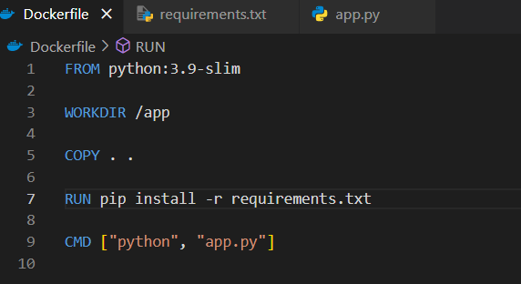
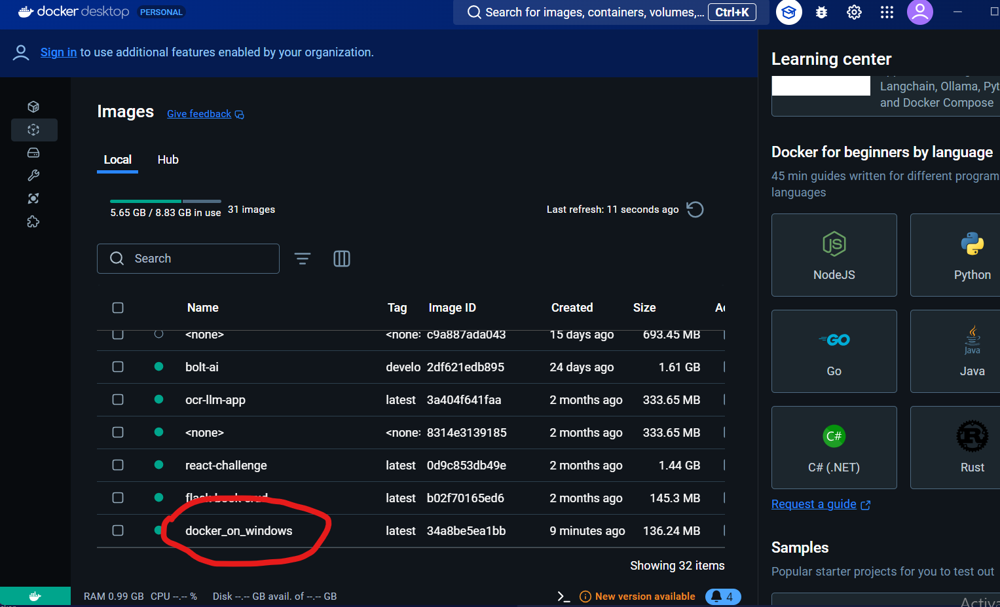
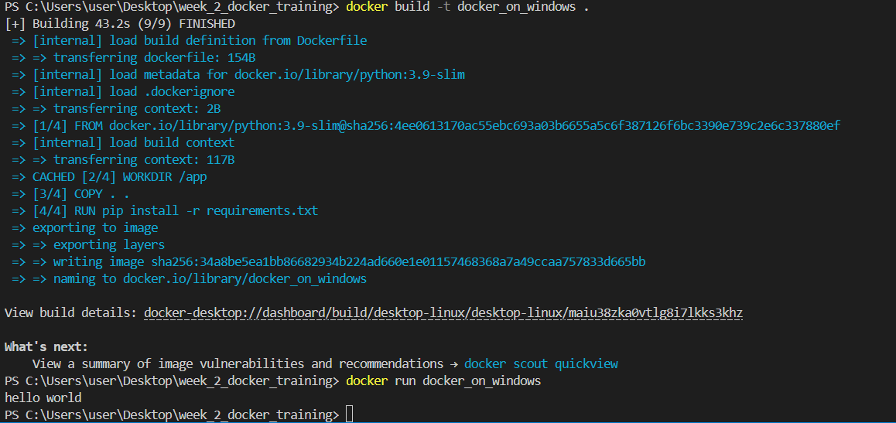

### **Training Task Report: Docker on Windows Desktop & Dockerized Small Project**

---

## **1. Run Docker on Windows Desktop**

### **Screenshots**
- **Dockerfile on Windows**
  

- **Docker Image Running on Desktop**
  

- **Running the Dockerfile**
  

---

## **2. Dockerized Simple RAG System**

This small project demonstrates how to create a **Retrieval-Augmented Generation (RAG)** system using **ChromaDB** for vector storage and **GitHub Marketplace OpenAI model** for text generation. The system is dockerized and served via a **FastAPI** server.

### **How It Works**
- **ChromaDB** stores and retrieves documents as vectors.
- **GitHub Marketplace OpenAI model** generates responses based on the retrieved context.
- **FastAPI** handles API requests for querying the system.

### **Setup and Run**

1. **Clone the repository**:
   ```bash
   git clone https://github.com/Yohannes90/training.git
   cd ./training/week_2_training_Docker/rag-system
   ```

2. **Build the Docker image**:
   ```bash
   docker build -t rag-system .
   ```

3. **Run the Docker container**:
   ```bash
   docker run -p 8000:8000 rag-system
   ```

4. **Test the API**:
   Use `curl` or Postman to send a POST request:
   ```bash
   curl -X POST "http://localhost:8000/query" \
   -H "Content-Type: application/json" \
   -d '{"user_query": "What is RAG?"}'
   ```

### **Files**
- `app.py`: Main application code for the RAG system.
- `Dockerfile`: Containerization setup for the project.
- `requirements.txt`: Python dependencies for the application.

---

### **Conclusion**
This project serves as a practical example of running Docker on Windows Desktop and creating a small, dockerized project using ChromaDB and OpenAI. The setup is straightforward, with a FastAPI interface for querying the RAG system.
