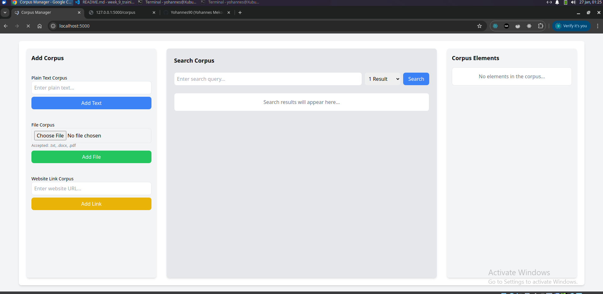
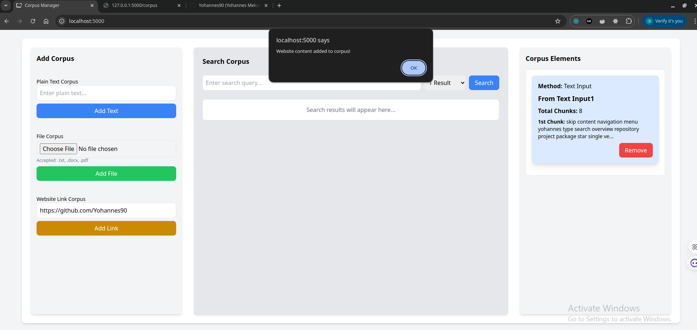
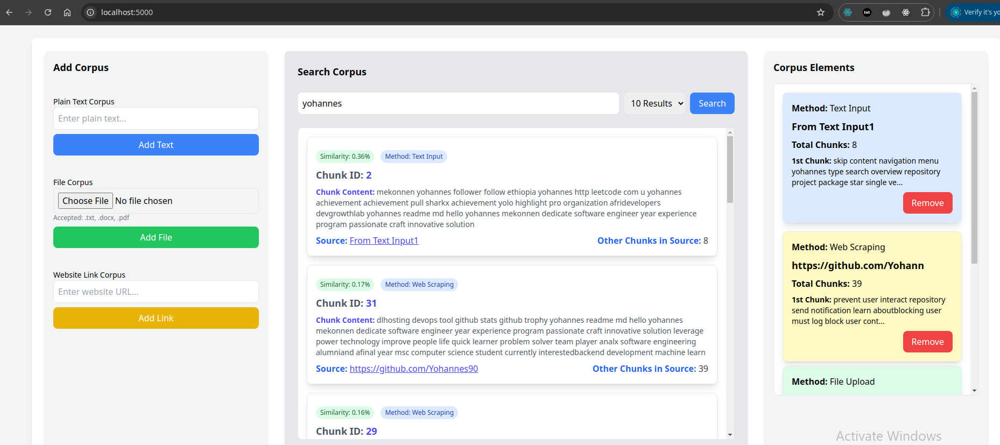

# Corpus Management and Search System

## Overview

The Corpus Management and Search System is a Flask-based web application designed for managing and searching text corpora. It offers multiple input methods, including text input, file uploads (TXT, DOCX, PDF), and web scraping. The system also incorporates semantic search using cosine similarity, enabling efficient content retrieval based on textual similarity.

## Key Features

- **Multiple Input Methods:**
  - Text input
  - File upload (.txt, .docx, .pdf)
  - URL scraping

- **Text Processing:**
  - Preprocessing and cleaning
  - Lemmatization and chunking for improved search results
  - TF-IDF vectorization for content representation

- **Search Capabilities:**
  - Semantic search with cosine similarity
  - Configurable number of results
  - Similarity score display

## Project Structure

```
search_system/
├── app.py               # Main Flask application
├── README.md            # Project documentation
├── requirements.txt     # Project dependencies
├── routes.py            # API endpoints and routing logic
├── screenshots/         # Directory for project screenshots
│   ├── adding_corpus.png
│   ├── opening_website_on_localhost.png
│   └── searching_results.png
├── static/              # Frontend assets
│   └── index.html       # Interface for user interaction
├── test.rest            # API tests using REST Client (VS Code extension)
├── uploads/             # Directory for uploaded files
└── utils.py             # Utility functions for text processing
```

## Getting Started

### Prerequisites

- Python 3.8+
- Flask 3.1.0
- Other dependencies listed in `requirements.txt`

### Installation

1. Clone the repository:

   ```bash
   git clone https://github.com/Yohannes90/training.git
   cd ./training/week_9_training_search_engine_with_lemmatization_tfidf_and_cosine_similarity/search_system
   ```

2. Create and activate a virtual environment:

   ```bash
   python3 -m venv venv
   source venv/bin/activate  # On Windows: venv\Scripts\activate
   ```

3. Install the required dependencies:

   ```bash
   pip install -r requirements.txt
   ```

### Technologies Used

- **Backend:** Flask
- **Text Processing:** NLTK, scikit-learn
- **Web Scraping:** BeautifulSoup
- **File Handling:** python-docx, PyPDF2
- **Frontend:** HTML, TailwindCSS (via CDN)

## Usage

1. Start the Flask server:

   ```bash
   python3 app.py
   ```

2. Access the application in your browser at:

   ```
   http://localhost:5000
   ```

### API Endpoints

- `GET /`: Main interface for the app.
- `POST /corpus/add`: Add content (text, file, or URL) to the corpus.
- `GET /corpus`: Retrieve all corpus items.
- `DELETE /corpus/remove/<source>`: Remove all items from a specified source.
- `POST /search`: Perform a semantic search query on the corpus.

### Example Usage

1. Add text or files to the corpus via the interface.
2. Submit a search query to find similar content within the corpus.
3. View the results, including similarity scores.

## Screenshots

- **Opening Website on Localhost**
  

- **Adding Corpus**
  

- **Searching Results**
  

## Conclusion

This project demonstrates the creation of a corpus management system with semantic search capabilities. It highlights skills in web development, text processing, and integrating machine learning techniques for improved content retrieval. The system provides an efficient way to manage and search large text corpora, making it useful for a variety of applications involving large datasets and document analysis.
