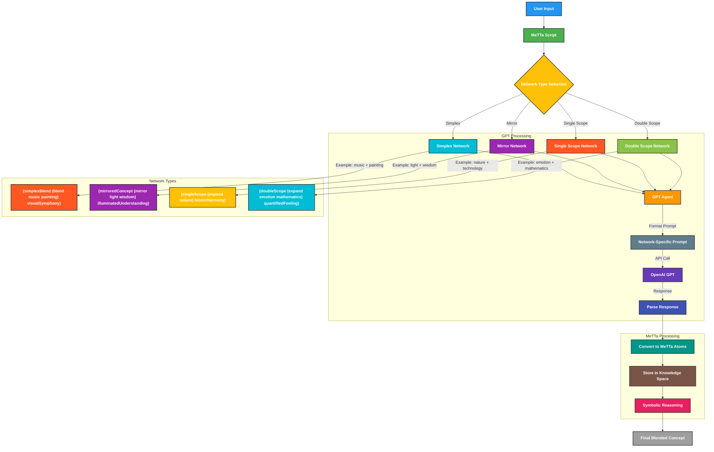

# Task 10: Improving Modularization in Conceptual Blending

## Overview
This task focuses on enhancing the modularization of the Conceptual Blending implementation to improve maintainability, scalability, and reusability. Key improvements include:

- Refinement of the GPT-based agent system
- Structured prompt generation for different blending networks
- Enhanced API authentication

The updates introduce a secure method for handling API authentication using environment variables and expand conceptual blending functionality by integrating **Simplex, Mirror, Single Scope, and Double Scope Networks**.

### Key Improvements:
1. **Enhanced API Authentication:**
   - Environment variables (`.env`) are now used to securely store API keys.
   - Supports both `GITHUB_TOKEN` and `OPENAI_API_KEY` for flexibility.

2. **Modularized Prompt Handling:**
   - A new `prompts/` directory has been added to manage different network blending prompts.
   - Each network has a dedicated prompt template (`simplex_network.py`, `mirror_network.py`, etc.).

3. **Refined GPT Agent Logic:**
   - `llmagent.py` now dynamically selects API authentication based on available tokens.
   - Improved request handling for OpenAI API calls.

4. **Extended Network-Based Blending:**
   - `gpt_agent.py` now selects appropriate prompts based on the chosen blending network.
   - The `main.py` logic registers multiple blending operations (`gpt_simplex`, `gpt_mirror`, `gpt_single`, `gpt_double`).

---

## Directory Structure

```plaintext
.
|-- conceptual_blending
|   |-- agents
|   |   |-- gpt_agent.py          # GPT-based agent for generating blended concepts
|   |   |-- __init__.py           # Initialize the agent module
|   |   |-- llmagent.py           # Handles API authentication and requests
|   |-- __init__.py               # Initialize the conceptual_blending module
|   |-- main.py                   # Main logic for blending concepts and running agents
|   |-- prompts                   # Prompt templates for different blending networks
|-- requirements.txt             # Python dependencies for the project
|-- run-conceptual-blending.metta # MeTTa script for reasoning and running the project
|-- .env                         # Environment variables for API authentication
```

## Changes Implemented

### 1. API Authentication Enhancement (`llmagent.py`)
- Uses `dotenv` to load API keys from `.env`.
- Prioritizes `GITHUB_TOKEN`, then `OPENAI_API_KEY`.
- Ensures secure API handling with error handling if no keys are found.

### 2. Modularized Prompt Handling (`prompts/` directory)
- Introduced separate files for different conceptual blending networks:
  - `simplex_network.py` (Simplex blending logic)
  - `mirror_network.py` (Mirror blending logic)
  - `single_scope_network.py` (Single scope blending logic)
  - `double_scope_network.py` (Double scope blending logic)
- Each file contains a predefined template with placeholders for dynamic inputs.

### 3. Improved GPT Agent Processing (`gpt_agent.py`)
- Now imports and selects the correct prompt based on the blending network.
- Uses the `get_prompt()` function to dynamically fetch the corresponding template.
- Constructs prompts dynamically using formatted strings for clarity.

### 4. Expanded Agent Registration (`main.py`)
- Introduced `NETWORKS` array to store different conceptual blending types.
- Registers four distinct GPT-based blending operations (`gpt_simplex`, `gpt_mirror`, `gpt_single`, `gpt_double`).
- Each operation dynamically calls the correct blending method using `prompt_agent()`.

---

## Flowchart



---

## Summary
This update adds structured prompt handling, improving API security, and introducing multiple conceptual blending networks. The refactored architecture ensures modularity, scalability, and enhanced user flexibility in defining blending operations.

## Repository
- [Pull Request](https://github.com/iCog-Labs-Dev/conceptBlending/pull/1/files)
- [Main Codebase](https://github.com/iCog-Labs-Dev/conceptBlending/)
- [My Fork](https://github.com/Yohannes90/conceptualBlending/)

---
