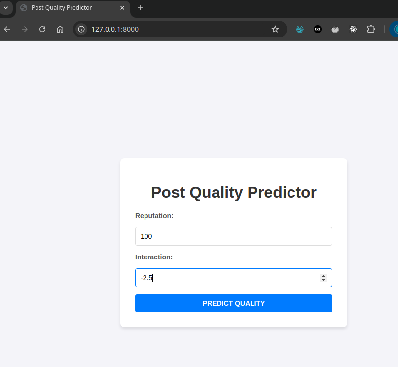
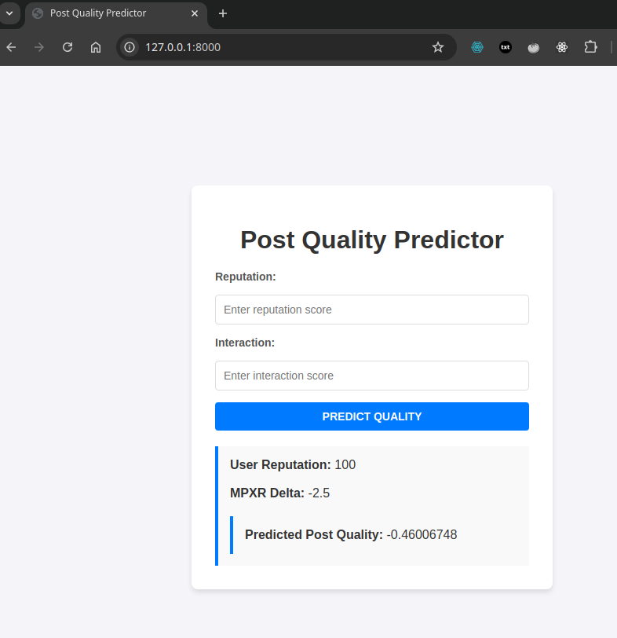
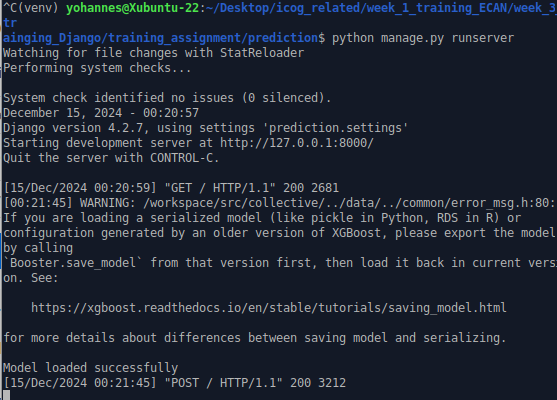

---

# **Training Task Report: Django Project with Post Quality Predictor Model**

## **Overview**

This project demonstrates integrating a machine learning model into a Django application. The **Post Quality Predictor Model** predicts post quality based on user reputation and interaction. The project includes a simple web interface for input submission, prediction, and result display. It also serves as a learning exercise in combining Django with ML.

---

## **Key Features**

1. **Django Backend**:
   - Handles form input and prediction requests.
   - Processes results from the ML model and renders them in a web interface.

2. **Post Quality Predictor Model**:
   - A trained ML model (`post_quality_model.joblib`) predicts post quality.
   - Built using synthetic data provided for the assignment.

3. **Interactive Web Form**:
   - Users can enter reputation and interaction values to receive a prediction.

4. **ML Integration**:
   - The model is integrated directly into Django views for seamless prediction handling.

---

## **Project Structure**

```plaintext
.
├── db.sqlite3
├── manage.py
├── predict
│   ├── admin.py
│   ├── apps.py
│   ├── migrations
│   │   └── __init__.py
│   ├── models.py
│   ├── post_quality_model.joblib
│   ├── post_quality_predictor.py
│   ├── synthetic_data.csv
│   ├── templates
│   │   └── predict.html
│   ├── tests.py
│   ├── Traain_and_Preedict_the_model_Quality.ipynb
│   ├── urls.py
│   └── views.py
└── prediction
    ├── settings.py
    ├── urls.py
    ├── wsgi.py
```

### **Relevant Files**:
- `predict/post_quality_predictor.py`: ML model loader and predictor logic.
- `predict/templates/predict.html`: HTML template for the web interface.
- `Traain_and_Preedict_the_model_Quality.ipynb`: Jupyter notebook for training and testing the model.

---

## **Setup and How to Run**

### **Prerequisites**
- Python 3.10+
- Django 4.x
- Required dependencies (install via `requirements.txt`).

### **Steps**

1. **Clone the repository**:
   ```bash
   git clone https://github.com/Yohannes90/training.git
   cd ./week_3_trainging_Django/training_assignment
   ```

2. **Install dependencies**:
   ```bash
   pip install -r requirements.txt
   ```

3. **Run migrations**:
   ```bash
   python manage.py migrate
   ```

4. **Start the development server**:
   ```bash
   python manage.py runserver
   ```

5. **Access the application**:
   Open your browser and navigate to [http://localhost:8000](http://localhost:8000).

---

## **Using the Application**

1. Enter **Reputation** and **Interaction** values into the input fields.
2. Click the **Predict Quality** button.
3. View the **predicted post quality** in the result section.

---

## **Screenshots**

### **1. Running the Application on Localhost**


### **2. Example Prediction Response**


### **3. Backend Running in Terminal**


---

## **Conclusion**

This project demonstrates the integration of Django with a machine learning model, providing a practical learning experience. It highlights how ML predictions can be incorporated into a web application, from form input handling to result display.

---

### **Key Learnings**
- Integration of ML models with Django.
- Creating user-friendly web interfaces connected with Django.
- Structuring Django projects for scalability.

---
