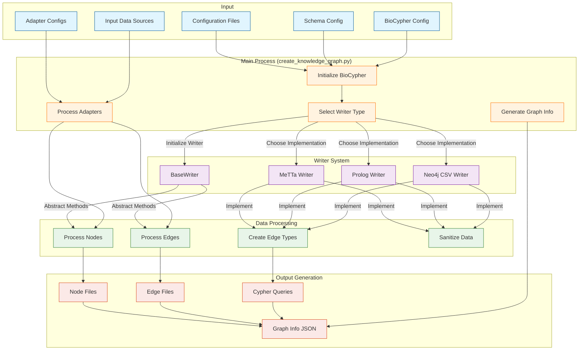
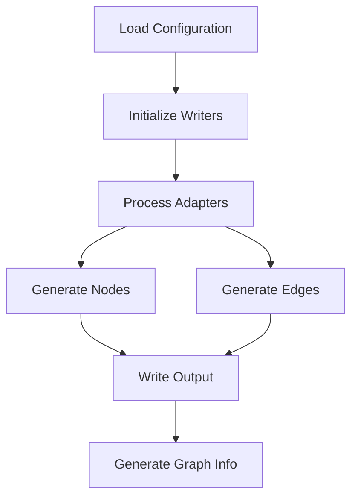
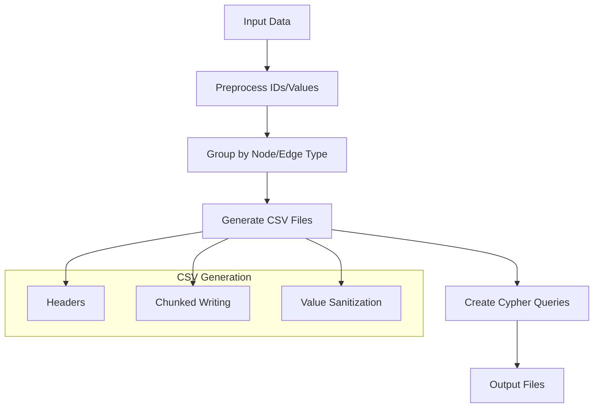

# Training Week 7: Graph Databases and Knowledge Representation with Neo4j Assignment

## Table of Contents
1. [Overview](#overview)
2. [Assignment Questions](#assignment-questions)
3. [BioCypher KG Technical Documentation](#biocypher-kg-technical-documentation)
    - [Core Components](#core-components)
    - [Data Flow](#data-flow)
    - [Usage Instructions](#usage-instructions)
    - [Testing and CI/CD](#testing-and-cicd)
    - [Extension Points](#extension-points)
    - [Best Practices](#best-practices)
4. [Neo4j CSV Writer Deep Dive](#neo4j-csv-writer-deep-dive)
    - [Core Functionality](#core-functionality)
    - [Data Processing Flow](#data-processing-flow)
    - [Output Structure](#output-structure)
    - [Neo4j Import Optimization](#neo4j-import-optimization)
    - [Integration Points](#integration-points)
    - [Best Practices Implemented](#best-practices-implemented)
5. [Proposed Solution for High Memory Usage Issue](#proposed-solution-for-high-memory-usage-issue)

---
## Overview
This document covers the Week 7 assignment for training on Graph Databases and Knowledge Representation. This assignment focuses on understanding and analyzing the BioCypher knowledge graph codebase and addressing a specific issue in the Neo4j CSV Writer.

BioCypher KG is a knowledge graph generation framework that processes various biomedical data sources and outputs them in multiple formats (MeTTa, Prolog, Neo4j). The project uses BioCypher as its core engine and implements a modular adapter-based architecture.

---
## Assignment Questions
1. Understand the BioCypher knowledge graph codebase ([GitHub Repository](https://github.com/rejuve-bio/biocypher-kg)) and prepare a technical documentation with a flow chart. focus on the `neo4j_csv_writer.py` module.
2. Analyze the issue of high memory usage and crashes in the `neo4j_csv_writer.py` when processing large datasets, and propose a solution.

---
## BioCypher KG Technical Documentation

### Core Components
1. **Knowledge Graph Creation Pipeline**
   - Entry point: `create_knowledge_graph.py` orchestrates the entire graph creation process.
   - Manages the end-to-end process, including data input, processing, and output.

2. **Writer System**
The project implements a flexible writer system through a base class and specific implementations:

   - **Base Writer**
        - Defined in `biocypher_metta/__init__.py`
        - Provides abstract methods for writing nodes and edges
        - Handles basic setup and counting functionality
   - **Specific Writers**:
        1. **MeTTa Writer**
            - Creates type hierarchies and data constructors
            - Handles node and edge relationships in MeTTa format

        2. **Prolog Writer**
            - Generates Prolog-compatible output
            - Manages edge type definitions and relationships

        3. **Neo4j CSV Writer**
            - Produces CSV files for Neo4j import
            - Creates Cypher queries for data loading

3. **Adapter System**
   - Defined in YAML files (e.g., `adapters_config.yaml`).
   - Key adapter types include:
    - Gene/Transcript adapters (GENCODE)
    - Protein adapters (UniProt)
    - Pathway adapters (Reactome)
    - Ontology adapters (GO, UBERON, etc.)
    - Expression data adapters (GTEx)

---
#### Flowchart Representation of Core Components and Their Interaction



---
### Data Flow
1. **Configuration Loading**
   - Load adapter configurations
   - Set up BioCypher instance
   - Initialize appropriate writer

2. **Data Processing**
   - Process adapters to generate nodes and edges.

3. **Output Generation**
   - Writers create format-specific output files
   - Graph information is collected and saved
   - Metadata and statistics are generated

#### Flow Chart Representation of Data Flow


---
### Usage Instructions
1. **Setup**
- Clone the repository and install dependencies:
   ```bash
   git clone https://github.com/rejuve-bio/biocypher-kg.git
   poetry install
   ```

2. **Run the pipeline**

```bash
poetry run python create_knowledge_graph.py \
--output-dir ./output \
--adapters-config ./config/adapters_config_sample.yaml \
--dbsnp-rsids ./aux_files/sample_dbsnp_rsids.pkl \
--dbsnp-pos ./aux_files/sample_dbsnp_pos.pkl \
--writer-type neo4j
```

---
3. **Configuration Files**
The system uses several configuration files:
- `adapters_config.yaml`: Defines data sources and processing parameters
- `schema_config.yaml`: Defines the knowledge graph schema
- `biocypher_config.yaml`: BioCypher-specific settings

---
### Testing and CI/CD
The project includes GitHub Actions workflows for testing:

The CI pipeline:
- Detects changed files
- Runs relevant tests based on changes
- Updates ontology cache
- Validates output formats

---
### Extension Points
1. **Adding New Adapters**
   - Create new adapter class in `biocypher_metta/adapters`
   - Add configuration in `adapters_config.yaml`
   - Implement required data processing methods

2. **Adding New Writers**
   - Extend `BaseWriter` class
   - Implement write_nodes and write_edges methods
   - Add writer type to command-line options

3. **Adding New Data Sources**
   - Create new adapter configuration
   - Implement data download/processing logic
   - Add necessary schema definitions

---
### Best Practices

1. **Data Processing**
   - Use BioCypher's built-in validation
   - Implement proper error handling
   - Cache processed data when appropriate

2. **Configuration Management**
   - Keep sensitive paths in environment variables
   - Use sample configs for testing
   - Document all configuration options

3. **Output Handling**
   - Validate output format compliance
   - Implement proper file handling
   - Include metadata with outputs

---
## Neo4j CSV Writer Deep Dive

The Neo4j CSV Writer is a crucial component that handles the transformation of knowledge graph data into Neo4j-compatible CSV files and Cypher queries. Here's a detailed breakdown:

### Core Functionality

1. **Initialization and Setup**
    - Inherits from BaseWriter
    - Uses pipe (`|`) as CSV delimiter to avoid conflicts with data content
    - Configures array delimiter for handling list properties

2. **Edge Type Management**
    - Creates a mapping between edge labels and their corresponding node types
    - Essential for maintaining referential integrity in Neo4j

3. **Process data in chunks to manage memory**
    - Handles large datasets efficiently
    - Default chunk size of 1000 records
    - Reduces memory footprint

4. **Node Writing**
    - Creates separate files for each node label
    - Automatically adds ontology labels where appropriate
    - Generates optimized Cypher import queries

5. **Edge Writing**
    - Maintains referential integrity
    - Handles complex relationship patterns
    - Optimizes for bulk importing

---
### Data Processing Flow



---
### Output Structure
```
output_directory/
    ├── nodes/
    │   ├── nodes_gene.csv
    │   ├── nodes_gene.cypher
    │   ├── nodes_protein.csv
    │   └── nodes_protein.cypher
    ├── edges/
    │   ├── edges_interacts_with_protein_protein.csv
    │   └── edges_interacts_with_protein_protein.cypher
```

---
### Neo4j Import Optimization

1. **Constraint Creation**
```cypher
CREATE CONSTRAINT IF NOT EXISTS FOR (n:label) REQUIRE n.id IS UNIQUE;
```
- Ensures data integrity
- Optimizes node lookup performance

2. **Batch Processing**
```cypher
CALL apoc.periodic.iterate(
"LOAD CSV...",
"MERGE...",
{batchSize:1000, parallel:true, concurrency:4}
)
```
- Uses APOC for efficient bulk imports
- Configurable batch size and concurrency
- Handles transaction management

### Integration Points

1. **With BioCypher Core**
    - Uses BioCypher's schema validation
    - Maintains ontology mappings
    - Follows BioCypher's data model

2. **With Other Writers**
    - Shares base functionality through BaseWriter
    - Maintains consistent ID handling
    - Uses common property preprocessing

3. **With Adapters**
    - Handles adapter-specific output directories
    - Processes adapter-specific data types
    - Maintains data provenance

### Best Practices Implemented

1. **Data Sanitization**
    - Prevents CSV injection
    - Maintains data integrity
    - Handles complex data types

2. **Error Handling**
    - Graceful handling of missing properties
    - Directory creation checks
    - Data validation

3. **Performance Optimization**
    - Chunked writing
    - Efficient memory usage
    - Parallel processing support

#### This writer is crucial for projects requiring:
- Large-scale data imports into Neo4j
- Complex biological relationship modeling
- Ontology-aware data handling
- Efficient bulk data loading

---
## Proposed Solution for High Memory Usage Issue
### Problem Analysis
The `neo4j_csv_writer.py` module crashes due to high memory usage when processing large datasets. This occurs because data is processed and written to CSV in large chunks.

### Solution
1. **Memory-Efficient Value Processing**
    - Memory-efficient value processing with size limits and warnings
    ```python
    def write_to_csv(self, data_iterator, file_path, chunk_size=1000):
        # First chunk to determine headers
        first_chunk = []
        headers = set()
        # for entry in data: # replace
        for i, entry in enumerate(data_iterator):
            if i < chunk_size:
                headers.update(entry.keys())
                first_chunk.append(entry)
            else:
                break
        headers = sorted(list(headers))
        if 'id' in headers:
            headers.remove('id')
            headers = ['id'] + headers
        # Write headers
        with open(file_path, 'w', newline='') as csvfile:
            writer = csv.writer(csvfile, delimiter=self.csv_delimiter)
            writer.writerow(headers)
        #    csvfile.flush()
        # for i in range(0, len(data), chunk_size):
        #    chunk = data[i:i+chunk_size]
        #    self.write_chunk(chunk, headers, file_path, self.csv_delimiter, self.preprocess_value)

            # Write first chunk
            self.write_chunk(first_chunk, headers, file_path, self.csv_delimiter, self.preprocess_value)
            # Process remaining data in chunks
            current_chunk = []
            for entry in data_iterator:
                current_chunk.append(entry)
                if len(current_chunk) >= chunk_size:
                    self.write_chunk(current_chunk, headers, file_path, self.csv_delimiter, self.preprocess_value)
                    current_chunk = []
            # Write any remaining data
            if current_chunk:
                self.write_chunk(current_chunk, headers, file_path, self.csv_delimiter, self.preprocess_value)
    ```

2. **Efficient File Handling with Context Manager**
    - Proper file handle management using a context manager
    ```python
    class CSVFileHandler:
        def __init__(self, file_path, delimiter):
            self.file_path = file_path
            self.delimiter = delimiter
            self.file = None
            self.writer = None

        def __enter__(self):
            self.file = open(self.file_path, 'a', newline='')
            self.writer = csv.writer(self.file, delimiter=self.delimiter)
            return self

        def __exit__(self, exc_type, exc_val, exc_tb):
            if self.file:
                self.file.close()

        def write_rows(self, rows):
            self.writer.writerows(rows)
            self.file.flush()

    def write_chunk(self, chunk, headers, file_path, csv_delimiter, preprocess_value):
        with CSVFileHandler(file_path, csv_delimiter) as handler:
            processed_rows = [[preprocess_value(row.get(header, '')) for header in headers]
                            for row in chunk]
            handler.write_rows(processed_rows)
    ```
---

### **NB:**
- The aid of AI tools was used for preparing this document.
---
