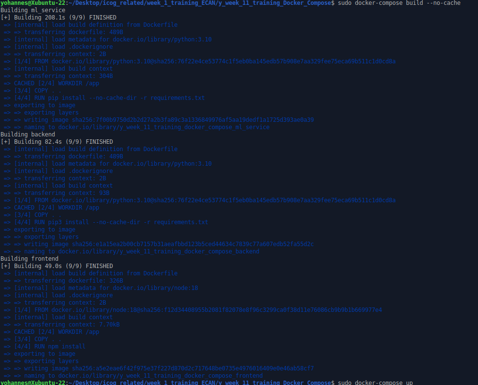
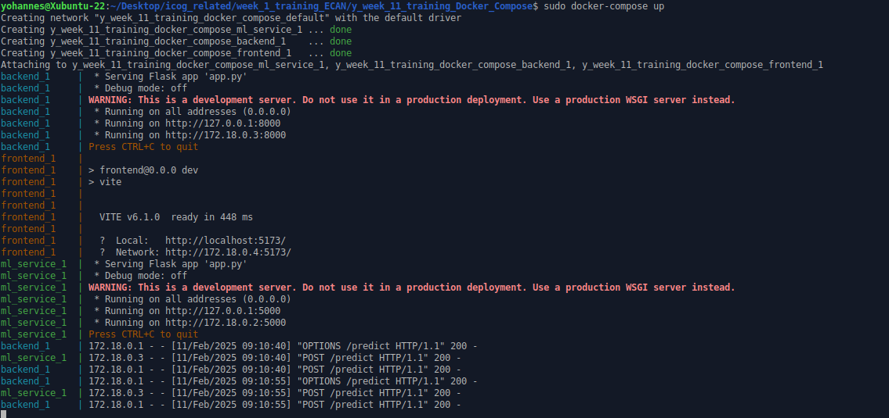
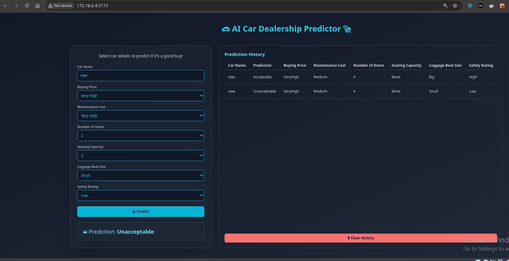

# Week 11 Training: Docker Compose

## Overview
This training task focused on building a simple project that utilizes Docker Compose to manage three separate services:
- **Frontend** (React with Vite and Tailwind CSS)
- **Backend** (Flask API)
- **ML Service** (Machine Learning model for car evaluation)

Each service has its own `Dockerfile` to containerize the application.

## Project Structure
```
.
|-- backend
|   |-- app.py
|   |-- Dockerfile
|   `-- requirements.txt
|-- docker-compose.yml
|-- frontend
|   |-- Dockerfile
|   |-- eslint.config.js
|   |-- index.html
|   |-- package.json
|   |-- package-lock.json
|   |-- postcss.config.js
|   |-- README.md
|   |-- src
|   |   |-- App.jsx
|   |   |-- index.css
|   |   `-- main.jsx
|   |-- tailwind.config.js
|   `-- vite.config.js
|-- ml_service
|   |-- app.py
|   |-- Dockerfile
|   |-- model
|   |   |-- best_decision_tree_model.pkl
|   |   |-- car_evaluation.csv
|   |   `-- DecisionTreeCarEvaluation.ipynb
|   `-- requirements.txt
`-- README.md
```

## Prerequisites
Ensure you have the following installed:
- [Docker](https://www.docker.com/)
- [Docker Compose](https://docs.docker.com/compose/)

## Getting Started

### 1. Clone the Repository
```sh
  git clone https://github.com/Yohannes90/training.git
  cd ./training/y_week_11_training_Docker_Compose
```

### 2. Build the Docker Containers
```sh
  sudo docker-compose build
```
_Screenshot reference: screenshot_output_of_running_sudo_docker-compose_build.png_


### 3. Run the Services
```sh
  sudo docker-compose up
```
_Screenshot reference: screenshot_output_of_running_sudo_docker-compose_up_and_successful_requests.png_


### 4. Verify Successful Requests
Check that the frontend successfully interacts with the backend and ML service.
_Screenshot reference: screenshot_frontend_displaying_two_successful_requests_on_prediction_history.png_


### 5. Running with Docker Compose
Once all services are running, verify they are functional.
_Screenshot reference: screenshot_running_with_docker_compose.png_

## Accessing the Application
- **Frontend:** http://localhost:5173
- **Backend API:** http://localhost:8000
- **ML Service API:** http://localhost:5000

## Docker Compose Configuration
The `docker-compose.yml` file defines all three services:
```yaml
version: '3.8'
services:
  ml_service:
    build: ./ml_service
    ports:
      - "5000:5000"
    restart: always

  backend:
    build: ./backend
    ports:
      - "8000:8000"
    depends_on:
      - ml_service
    restart: always

  frontend:
    build: ./frontend
    ports:
      - "5173:5173"
    depends_on:
      - backend
    restart: always
```

## Technologies Used
- **Frontend:** React (Vite), Tailwind CSS
- **Backend:** Flask
- **ML Service:** Flask, Scikit-learn (Decision Tree Model)
- **Docker & Docker Compose**

## Conclusion
This training task demonstrated how to containerize multiple services and orchestrate them using Docker Compose. The project successfully integrated frontend, backend, and an ML model, ensuring seamless interaction between the services.
